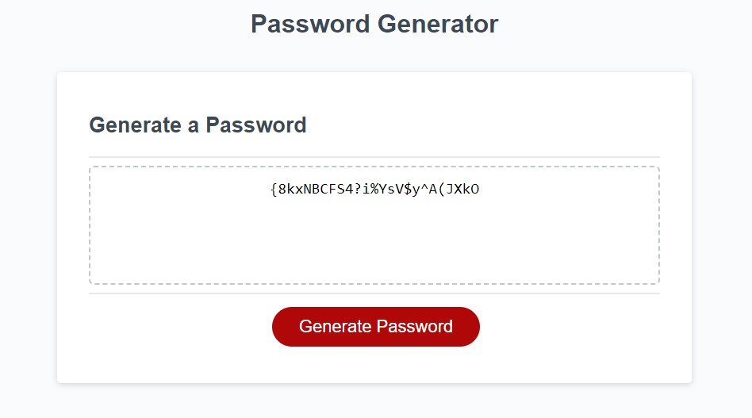

# Javascript Password Generator
The purpose of this website is to let users generate a random password to help them be more secure. 

## Description
This website uses basic javascript to prompt the user, when a button is clicked. With the information provided by the user in the prompts, a random password is successfully generated.

## Deployed Application

## Author

`Corbin Johns`

Check out my [GitHub](https://github.com/cxrstings)!